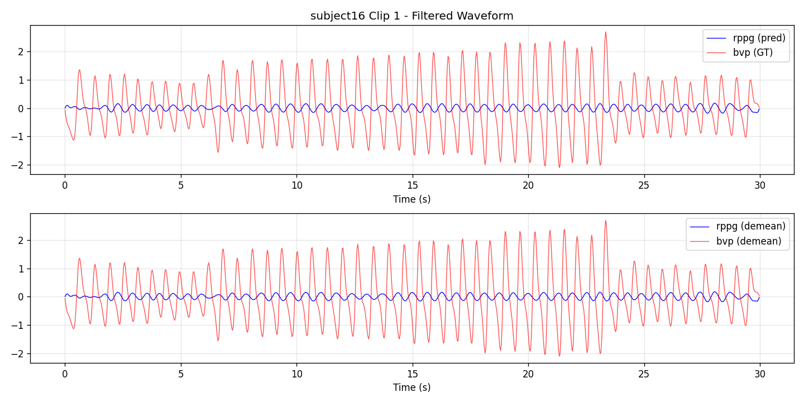
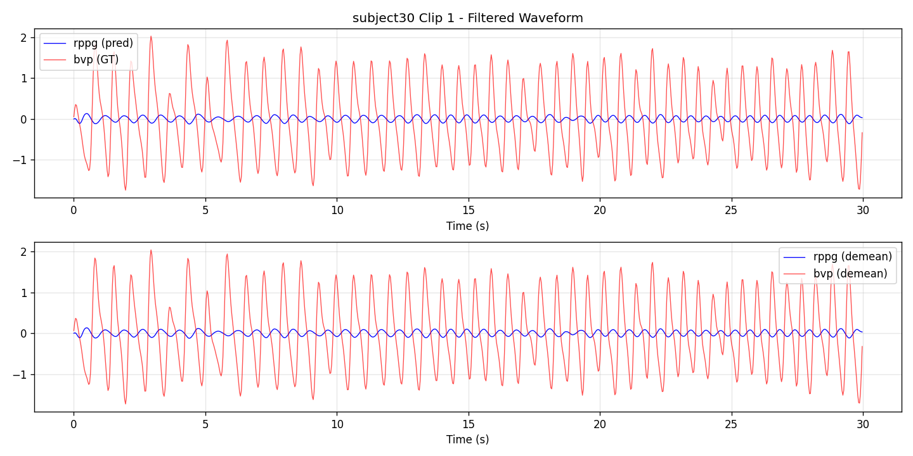
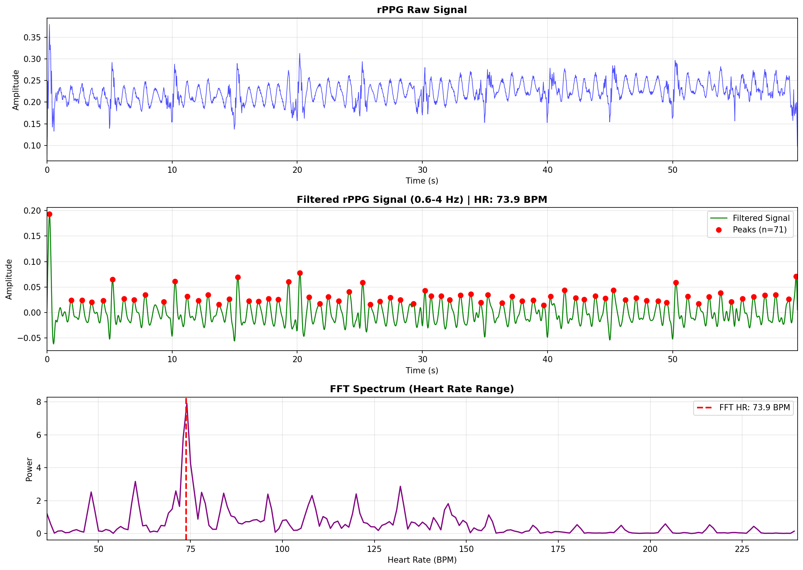
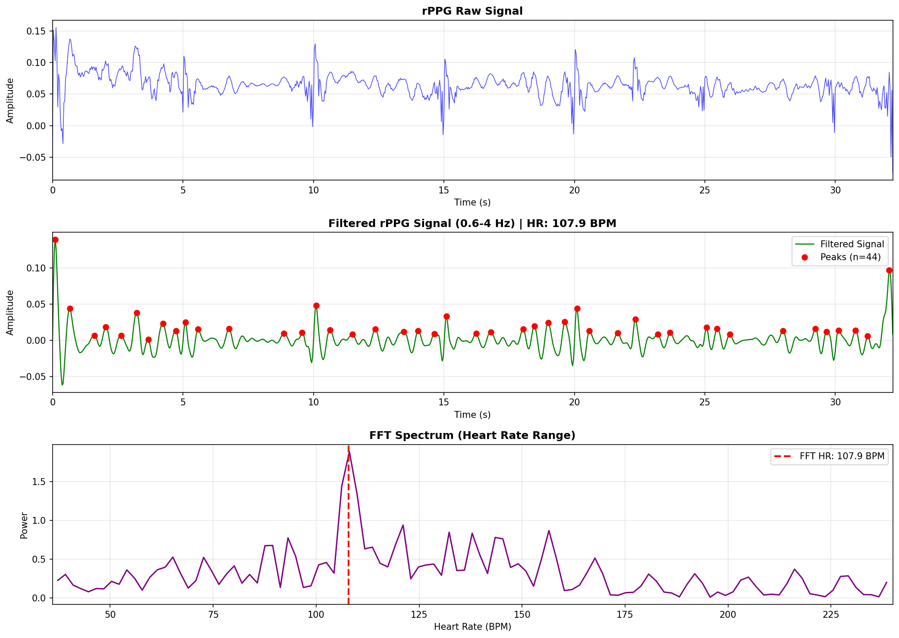

# Video-based rPPG Heart Rate Estimation (Contrast-Phys+)

Video-based remote photoplethysmography (rPPG) for heart rate estimation, built on [Contrast-Phys+](https://ieeexplore.ieee.org/document/10440521) (TPAMI 2024). Uses spatiotemporal contrastive learning for unsupervised and weakly-supervised training.

[Paper](https://www.ecva.net/papers/eccv_2022/papers_ECCV/papers/136720488.pdf) | [Poster](https://github.com/zhaodongsun/contrast-phys/releases/download/aux/0205.pdf) | [Video](https://github.com/zhaodongsun/contrast-phys/releases/download/aux/0205.mp4)

## Methodology


PhysNet extracts ST-rPPG blocks from face videos; contrastive loss aligns PSD of rPPG samples. Supports unsupervised (`label_ratio=0`) and fully-supervised (`label_ratio=1`) training.

## Contributions (This Repo)

- **Evaluation pipeline**: Implemented full PSD-level and HR-level metrics (MAE, RMSE, P5, P10, Pearson, CCC) with robust signal processing (harmonics removal, parabolic interpolation).
- **Real-world Application & Camera Exploration**: Explored the real-world application of this method with different label ratios (unsupervised vs. supervised) and investigated the performance of different camera models.
- **Live inference**: Developed real-time / offline video rPPG prediction pipeline with `live_predict_webcam.py`.
- **Waveform visualization**: Added visualization tools for model predictions against ground truth on both test sets and live data.
- **Pre-trained models**: Provided best unsupervised and supervised weights for quick inference.

## Quick Start (Inference)

```bash
pip install -r requirements.txt
cd contrast-phys+
python live_predict_webcam.py --train-exp-dir pretrained/unsupervised --source 0 --duration 30
```

With video file:
```bash
python live_predict_webcam.py --train-exp-dir pretrained/unsupervised --source video.mp4 --duration 60 --face
```

## Installation

```bash
pip install -r requirements.txt
# or: conda env create -f environment.yml
```

For preprocessing (OpenFace, dlib): see `prep/setup_ubuntu_preprocessing.sh`.

## Dataset

UBFC-rPPG Dataset 2. Preprocessing: OpenFace landmarks → crop face 128×128 → H5 with `imgs` and `bvp`.

```
dataset/
├── 1.h5, 3.h5, ...
  X.h5: imgs [N,128,128,3], bvp [N]
```

See `prep/preprocess_ubfc_complete.sh` and `preprocess_ubfc.py`.

## Training

```bash
cd contrast-phys+
python train.py
# Unsupervised: label_ratio=0 (default)
# Supervised:   python train.py with label_ratio=1
```

Weights saved to `results/label_ratio_X/<run_id>/`.

## Evaluation

### Test Set Inference

```bash
python test.py with train_exp_num=1
```

### Evaluation Pipeline

```bash
python evaluation/evaluate_from_test.py <pred_dir> [--save-viz]
```

- **PSD-level**: Normalized PSD correlation, MSE (aligned with training)
- **HR-level**: butter_bandpass (0.6–4 Hz) → FFT → MAE, RMSE, P5, P10, Pearson, CCC
- `--save-viz`: Save pred vs GT waveform plots

## Results

### Test Set (UBFC-rPPG)

On held-out test clips, unsupervised and supervised achieve similar metrics:

| Model        | MAE (BPM) | RMSE | P5   | P10  |
|--------------|-----------|------|------|------|
| Unsupervised | 1.29      | 3.99 | 91.7%| 91.7%|
| Supervised   | 1.29      | 3.99 | 91.7%| 91.7%|

### Real-world: Camera Domain Shift

We explored the performance of the model in real-world scenarios using different cameras (Logitech C920 vs. MacBook Pro Webcam). We found that domain shifts (differences in resolution, frame rate, color space, and compression) significantly impact performance compared to the clean UBFC dataset. 

While unsupervised models perform well on the in-domain test set, our exploration suggests that supervised models may offer different trade-offs in cross-domain settings. We analyzed these discrepancies to guide future domain adaptation efforts.

### Waveform Visualization

**UBFC-rPPG Test Set – Predicted rPPG vs. Ground Truth BVP (Supervised Model):**


*Figure 1: Comparison of predicted rPPG waveform (blue) vs. ground truth BVP (orange) for Subject 16. The model accurately captures heart rate variability.*


*Figure 2: Comparison for Subject 30. Note the alignment of peaks despite amplitude differences.*

**Real-world Live Inference Waveform:**

*Unsupervised model (label_ratio=0):*



*Supervised model (label_ratio=1):*



*Figure 3: Real-time rPPG waveform extraction from live webcam feeds. Raw signal → bandpass filter (0.6–4 Hz) → peak detection → FFT for HR estimation.*

## Pre-trained Models

| Model        | Path                          |
|--------------|-------------------------------|
| Unsupervised | `pretrained/unsupervised/`    |
| Supervised   | `pretrained/supervised/`      |

Each contains `best_model.pt` and `config.json`.

## Signal Processing

- **Bandpass**: 0.6–4 Hz (36–240 BPM)
- **HR estimation**: FFT + parabolic interpolation (`hr_fft_parabolic`)
- **Harmonics removal**: Optional, for ambiguous peaks

## Citation

```bibtex
@article{sun2024,
  title={Contrast-Phys+: Unsupervised and Weakly-supervised Video-based Remote Physiological Measurement via Spatiotemporal Contrast},
  author={Sun, Zhaodong and Li, Xiaobai},
  journal={TPAMI},
  year={2024}
}

@inproceedings{sun2022contrast,
  title={Contrast-Phys: Unsupervised Video-based Remote Physiological Measurement via Spatiotemporal Contrast},
  author={Sun, Zhaodong and Li, Xiaobai},
  booktitle={ECCV},
  year={2022}
}
```
